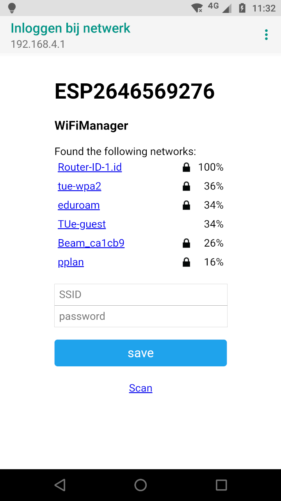

# WiFiManager
ESP32 WiFi Connection manager with fallback web configuration portal


The configuration portal is of the captive variety, so on various devices it will present the configuration dialogue as soon as you connect to the created access point.

Fork from [Zhouhan0126 WIFIMANAGER-ESP32](https://github.com/zhouhan0126/WIFIMANAGER-ESP32) with various patches.

## Library
This library uses the WebServer and DNSServer libraries.

## How It Looks



## Usage
Include in your sketch:
```cpp
#include <WiFiManager-ESP32.h>         

```

Create a global WiFiManager object:
```cpp
WiFiManager wifiManager;
```

In the setup function add:
```cpp
wifiManager.configure("esp32", nullptr);
// first parameter is name of access point, second is the callback function
```

After you write your sketch and start the ESP, it will try to connect to WiFi. If it fails it starts in Access Point mode.
While in AP mode, connect to it. Your browser should automatically open and load the configuration page; if not go to 192.168.4.1. Configure wifi, save and it should reboot and connect.

If you're application needs to reset the WiFi settings (for example when the user presses a button), you can do this before calling `configure()`:

```cpp
pinMode(BUTTON_BUILTIN, INPUT);

// Give user 3 second chance to press button and reset settings
Serial.println("Waiting 3 seconds to check if user presses the button");
delay(3000);
if (not digitalRead(BUTTON_BUILTIN)) {
    wifiManager.resetSettings();
}
```

If you're application needs to be notified of the configuration process, you can pass a callback function instead of the `nullptr`:

```cpp
wifiManager.configure("esp32", wifiManagerCb);
```

The following example function will blink an led at different rates for different parts of the configuration process.

```cpp
#define TICKER_RATE_CONNECTING 0.6
#define TICKER_RATE_CONFIG 0.2
#define TICKER_RATE_ERASE 0.05

Ticker ticker;

void wifiManagerCb(WiFiManager::Status status) {
    if (ticker.active()) {
        ticker.detach();
    }

    if (status.mode == WiFiManager::Mode::CONNECTING) {
        ticker.attach(TICKER_RATE_CONNECTING, tick);
        Serial.println("CONNECTING");
    } else if (status.mode == WiFiManager::Mode::SCANNING) {
        ticker.attach(TICKER_RATE_CONNECTING, tick);
        Serial.println("SCANNING");
    } else if (status.mode == WiFiManager::Mode::PORTAL) {
        ticker.attach(TICKER_RATE_CONFIG, tick);
        Serial.println("PORTAL");
    } else if (status.mode == WiFiManager::Mode::ERASING) {
        ticker.attach(TICKER_RATE_ERASE, tick);
        Serial.println("ERASING");
    } else if (status.mode == WiFiManager::Mode::CONNECTED) {
        digitalWrite(LED_BUILTIN, HIGH);
        Serial.println("CONNECTED");
    } else if (status.mode == WiFiManager::Mode::DISCONNECTED) {
        digitalWrite(LED_BUILTIN, LOW);
        Serial.println("DISCONNECTED");
    }
}
```

## Documentation

#### Configuration Portal Timeout
If you need to set a timeout so the ESP doesn't hang waiting to be configured, for instance after a power failure, you can add
```cpp
wifiManager.setConfigPortalTimeout(180);
```
which will wait 3 minutes (180 seconds). When the time passes, the autoConnect function will return, no matter the outcome.
Check for connection and if it's still not established do whatever is needed (on some modules I restart them to retry, on others I enter deep sleep)

#### Custom Parameters
You can use WiFiManager to collect more parameters than just SSID and password.
This could be helpful for configuring stuff like MQTT host and port, [blynk](http://www.blynk.cc) or [emoncms](http://emoncms.org) tokens, just to name a few.
**You are responsible for saving and loading these custom values.** The library just collects and displays the data for you as a convenience.
Usage scenario would be:
- load values from somewhere (EEPROM/FS) or generate some defaults
- add the custom parameters to WiFiManager using
 ```cpp
 // id/name, placeholder/prompt, default, length
 WiFiManagerParameter custom_mqtt_server("server", "mqtt server", mqtt_server, 40);
 wifiManager.addParameter(&custom_mqtt_server);

 ```
- if connection to AP fails, configuration portal starts and you can set /change the values (or use on demand configuration portal)
- once configuration is done and connection is established [save config callback]() is called
- once WiFiManager returns control to your application, read and save the new values using the `WiFiManagerParameter` object.
 ```cpp
 mqtt_server = custom_mqtt_server.getValue();
 ```  
This feature is a lot more involved than all the others, so here are some examples to fully show how it is done.
You should also take a look at adding custom HTML to your form.

- Save and load custom parameters to file system in json form [AutoConnectWithFSParameters](https://github.com/tzapu/WiFiManager/tree/master/examples/AutoConnectWithFSParameters)
- *Save and load custom parameters to EEPROM* (not done yet)

#### Custom HTML, CSS, Javascript
There are various ways in which you can inject custom HTML, CSS or Javascript into the configuration portal.
The options are:
- inject custom head element
You can use this to any html bit to the head of the configuration portal. If you add a `<style>` element, bare in mind it overwrites the included css, not replaces.
```cpp
wifiManager.setCustomHeadElement("<style>html{filter: invert(100%); -webkit-filter: invert(100%);}</style>");
```
- inject a custom bit of html in the configuration form
```cpp
WiFiManagerParameter custom_text("<p>This is just a text paragraph</p>");
wifiManager.addParameter(&custom_text);
```
- inject a custom bit of html in a configuration form element
Just add the bit you want added as the last parameter to the custom parameter constructor.
```cpp
WiFiManagerParameter custom_mqtt_server("server", "mqtt server", "iot.eclipse", 40, " readonly");
```

#### Filter Networks
You can filter networks based on signal quality and show/hide duplicate networks.

- If you would like to filter low signal quality networks you can tell WiFiManager to not show networks below an arbitrary quality %;
```cpp
wifiManager.setMinimumSignalQuality(10);
```
will not show networks under 10% signal quality. If you omit the parameter it defaults to 8%;

- You can also remove or show duplicate networks (default is remove).
Use this function to show (or hide) all networks.
```cpp
wifiManager.setRemoveDuplicateAPs(false);
```

#### Debug
Debug is enabled by default on Serial. To disable add before autoConnect
```cpp
wifiManager.setDebugOutput(false);
```


### Contributions and thanks
The support and help I got from the community has been nothing short of phenomenal. I can't thank you guys enough. This is my first real attept in developing open source stuff and I must say, now I understand why people are so dedicated to it, it is because of all the wonderful people involved.

__THANK YOU__

[Shawn A](https://github.com/tablatronix)

[Maximiliano Duarte](https://github.com/domonetic)

[alltheblinkythings](https://github.com/alltheblinkythings)

[Niklas Wall](https://github.com/niklaswall)

[Jakub Piasecki](https://github.com/zaporylie)

[Peter Allan](https://github.com/alwynallan)

[John Little](https://github.com/j0hnlittle)

[markaswift](https://github.com/markaswift)

[franklinvv](https://github.com/franklinvv)

[Alberto Ricci Bitti](https://github.com/riccibitti)

[SebiPanther](https://github.com/SebiPanther)

[jonathanendersby](https://github.com/jonathanendersby)

[walthercarsten](https://github.com/walthercarsten)

Sorry if i have missed anyone.

#### Inspiration
- http://www.esp8266.com/viewtopic.php?f=29&t=2520
